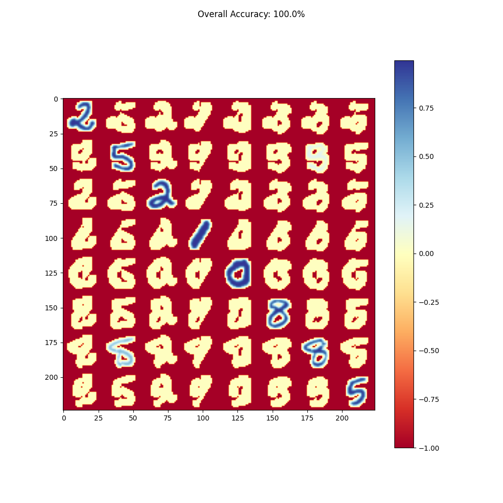
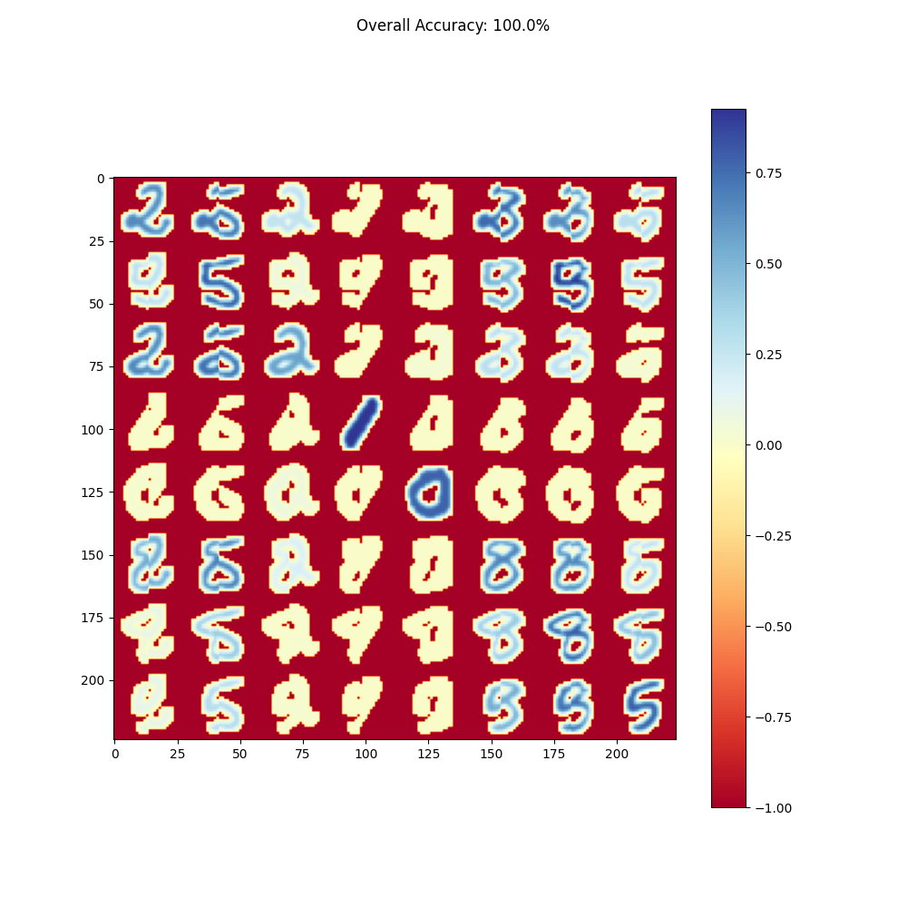

# Amphisbaena


> Imagine the digits in the test set of the MNIST dataset
> (http://yann.lecun.com/exdb/mnist/) got cut in half vertically and shuffled
> around. Implement a way to restore the original test set from the two halves,
> whilst maximising the overall matching accuracy.

This repository is the training and inference code for a deep learning approach to solve the above.

## Approach

An obvious method to solve this problem is to train a neural network contrastively. That is, a digit for which the left and right halves are from the same image has a label of `1` and a label of `0` otherwise.

Then, for each possible pair of left and right halves, the model predicts a label. To restore the original digit, we need only solve the [assignment problem](https://en.wikipedia.org/wiki/Assignment_problem), which has an excellent [implementation in scipy](https://docs.scipy.org/doc/scipy/reference/generated/scipy.optimize.linear_sum_assignment.html).

## Why "Amphisbaena"?

An amphisbaena is a two-headed snake. Unlike a siamese network, the image recognition arms do not share parameters.

## Usage

### Training

Install with poetry

```bash
poetry install
```

Begin by sweeping for usable hyperparameters.

```bash
wandb login
poetry run cli --wandb-project amphisbaena sweep --sweep-config-fp sweep.yml
```

Once an acceptable model is trained, check the artifact path in wandb.

```bash
wandb artifact get jfisher40/amphisbaena/amphisbaena:v6
```

Alternately, use git lfs to download the model that is 99% accurate (on MNIST validation fold) that I already trained 😁

```bash
git lfs pull
```

### Inference

```python
import torch
from pl_bolts.datamodules.mnist_datamodule import MNISTDataModule

from amphisbaena.model import Amphisbaena
from amphisbaena.viz import visualize_model_outputs, visualize_shuffled_batch
from amphisbaena.data import create_shuffled_batch, split

model = Amphisbaena.from_checkpoint("highly_performing_conv_model.ckpt")
```

Preprocess the MNIST data

<details>

```python
data = MNISTDataModule(
    num_workers=multiprocessing.cpu_count(),
    normalize=True,
    batch_size=512 if torch.cuda.is_available() else 64,
    val_split=0.01,
)
if backbone.startswith("conv"):
    pipeline = [T.Resize((100, 100)), data.default_transforms()]
    transforms = T.Compose(pipeline)
    data.train_transforms = data.val_transforms = data.test_transforms = transforms
    data.prepare_data()
    data.setup()
else:
    data.train_transforms = data.val_transforms = data.test_transforms = None
data.prepare_data()
data.setup()
```

</details>

Run inference with the `.assign()` method:

```python
from amphisbaena.data import split

batch = next(iter(data.val_dataloader()))
(imgs, _) = batch
lefts, rights = split(imgs)
model.assign(lefts, rights).idxs_left_pred
```

You can visualize the matching with the `visualize_model_outputs` method.

```python
visualize_model_outputs(model, imgs[:8,...]);
```

A well-performing model will produce a visualization where left-halves have a high-score when matched to their corresponding right-halves. These correct matches are on the diagonal. A high-score is blue.

Correspondingly, the incorrect matches (which are off-diagonal) should have a low-score. Low-score is yellow.



A poorly performing model will assign high-scores to incorrect matches and low-scores to correct matches, like so:


